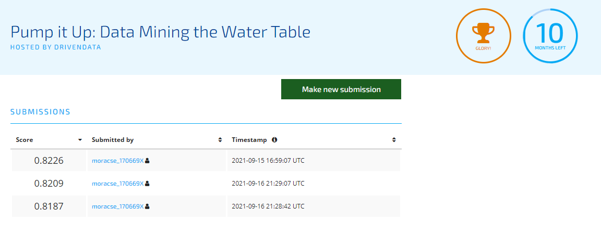
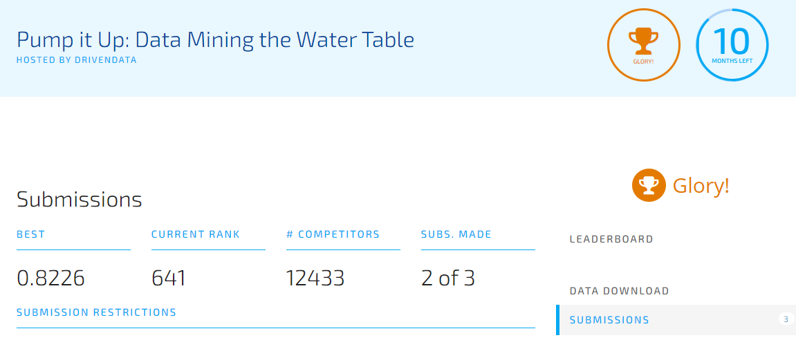

# Submission to "Pump it Up: Data Mining the Water Table" competition on DrivenData

## Preprocessing techniques

1. Imputed missing values in the following categorical columns with the most frequent value in each of them: `'funder', 'installer', 'subvillage', 'public_meeting', 'scheme_management', 'scheme_name', 'permit'`.
2. Imputed 0 values in `construction_year` with the earliest value of construction year.
3. Imputed `longitude` and `latitude` values of records whose `longitude` were below 29, with the **mean values of `longitude` and `latitude` when grouped by `region_code`**. The reason was that according to the GPS coordinates of Tanzania (`-6.3728253, 34.8924826`), longitude values must be over 29. (Refer [here](https://www.google.com/maps/place/Tanzania/@-6.3423805,30.4890535,6z/data=!3m1!4b1!4m5!3m4!1s0x184b51314869a111:0x885a17314bc1c430!8m2!3d-6.369028!4d34.888822))
4. Imputed `date_recorded` values whose years were before `construction_year`, with the latest value of `date_recorded`.

All Imputation values were based on training data. Test data were transformed using those imputation values.

## Feature Engineering techniques

1. Created a new feature called `age` representing how old a waterpoint is, by subtracting the year of `date_recorded` from `construction_year`.
2. Separated out year and month as `year_recorded` and `month_recorded` respectively, from `date_recorded`.
3. Excluded columns `id, date_recorded, recorded_by, num_private` from training features.
4. Applied Label (Integer) Encoding on categorical features. Encodings were based on training data. Unknown values in test data were labelled as 0 using a custom function.

## Proof of submission

## Final Rank
### 641

